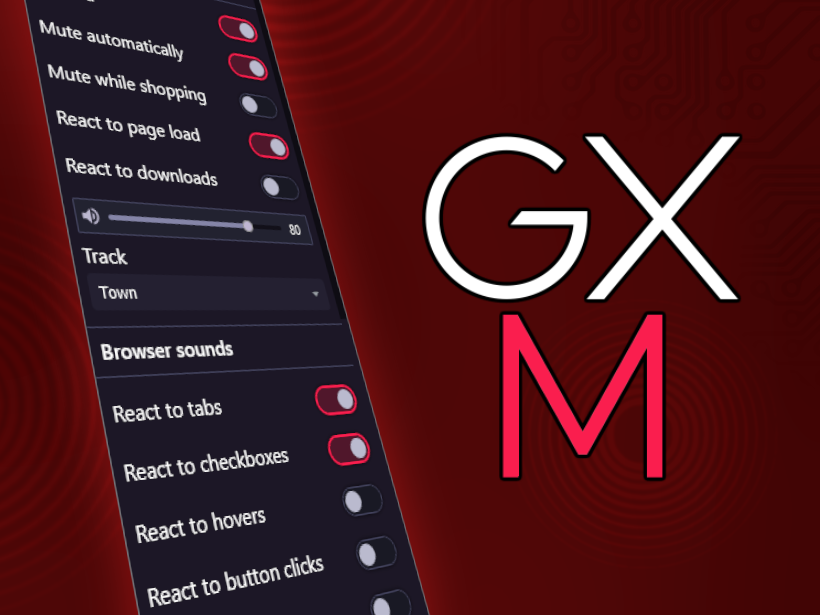

# GX Mods
 A WebExtension for Firefox. Add ambient music, typing sounds, and more to your browsing experience.

 **This is a Chrome-compatible version via Mozilla's [WebExtension polyfill](https://github.com/mozilla/webextension-polyfill). This is literally a low-effort port I did in 10 minutes. There are a lot of visual bugs, but it should still be fully functional.**

 *Tested on Vivaldi 6.4.3160.44 (Stable channel) (64-bit)*

# Disclaimer
 **Nobody here is affiliated with Opera Norway, Opera Software, or Otello Corporation in any way, shape, or form.**
 
 *Please don't expect support from them for this extension*, and furthermore, don't get mad at them if the extension accidentally sends your grandma to Mars or something.
 
 Yell at the blue dog who made it instead! 🐺
 
# Credits & Attribution
 [Taylor](https://github.com/tayiorrobinson) for creating the first version of this. Formerly "GX Music", GXM used to be a lot simpler... then I got bored. 🐺
 
 [Ivan Stanton](https://opengameart.org/users/northivanastan) for the MIDI song "The Journey Continues".
 
 [Opera Norway](https://www.opera.com/gx) for creating a browser with lots of sounds. I like sounds.
 
 For the Common soundpack, the attributions are next to their related sound effects.
 
 town.mid is on like, every Windows computer. Are you using Windows? I bet you are...

# Privacy Policy
 **GXM does not collect any data.**
 
 Some things might be read, like the URL or the state of downloads, or browsing activity, but *all of that information is* ***NEVER*** *sent over the Internet*. It's only used internally, by the extension, so the music can react to events.
 
 **If you enable "Mute while shopping", [a list of shopping websites](https://cdn.jsdelivr.net/gh/corbindavenport/shop-list/list.txt) will be downloaded from jsdelivr.**
 
 However, you probably won't need to toggle it on unless you're using the [Wii Shop Channel](https://addons.mozilla.org/en-US/firefox/addon/wii-shop-channel/) extension alongside GXM.
 
 If you don't want to ping jsdelivr, don't flip that toggle! ^^;

# Required Permissions
 🌐 **Access your data for all websites**: Required so GXM can detect page events like mouse clicks and hovers to ramp up the music.
 
 *GXM won't read your cookies or anything like that.*
 
 📥 **Download files and read and modify the browser's download history**: Required so GXM can ramp up the music when downloads finish, if you so choose.
 
 *GXM won't download stuff or rewrite history. It only checks when downloads finish.*
 
 🔔 **Display notifications to you**: Required to tell you when mods are installed, and what content has been added.
 
 *GXM won't notify you for anything other than that.*
 
 📂 **Access browser tabs**: Required to ramp up the music and play sound effects when tabs are opened and closed, plus disable the music in certain situations.
 
 *GXM will only care about the URL you're on if you have "Disable music while shopping" enabled. Even then, it's just used to mute the music.*
 
 ⏳ **Access browser activity during navigation**: Required to ramp up the music when pages load, if you so choose.
 
 *I don't know what kind of shady thing you could do with this permission, but whatever it is, GXM won't do it.*
 
 💾 **Store unlimited amount of client-side data**: Required to store downloaded/created mods.
 
 *Without this permission, the extension would stop working after you download too many mods. I mean, it still can, but it's just highly unlikely now.*

# Installation
 Download this branch as a ZIP file.

 Then, enable Developer Mode in your browser and load the extension.

 It isn't ideal, but I don't really feel like going through yet another addon review process -- especially since this still uses Manifest V2 ¯\\\_(ツ)_/¯

# Usage
 By default, the extension comes with some default sound packs for you to play around with. Select one from the dropdown and the sounds will load in a second.
 
 If you want to play around with the browser sounds, [this page](https://www-archive.mozilla.org/projects/ui/accessibility/unix/testcase/html/#Button_Test_Cases) is a pretty good place to start.
 
 When you start craving some more, you can make your own mods by opening the extension popup and scrolling to the bottom. There'll be a "Mods" button. Click that and you'll be good to go!
 
 Alternatively, you can *install real Opera GX mods* by heading to the [GX Store](https://store.gx.me/mods/). Only sounds, though. No themes or wallpapers (yet).

# Uninstalling the extension
 Warning you now! ***Before uninstalling/unloading the extension, please be sure to set all of your selected tracks to "None/No music"!*** Otherwise you will leak some memory.
 
 I would fix this myself, but Firefox doesn't offer a way to run a cleanup task before an extension fully unloads.. at least as far as I can tell.
 
 *Setting the tracks to "None/No music" allows the extension to fully clean itself up.* The Enabled switch just mutes the music, so don't be fooled by that either.
